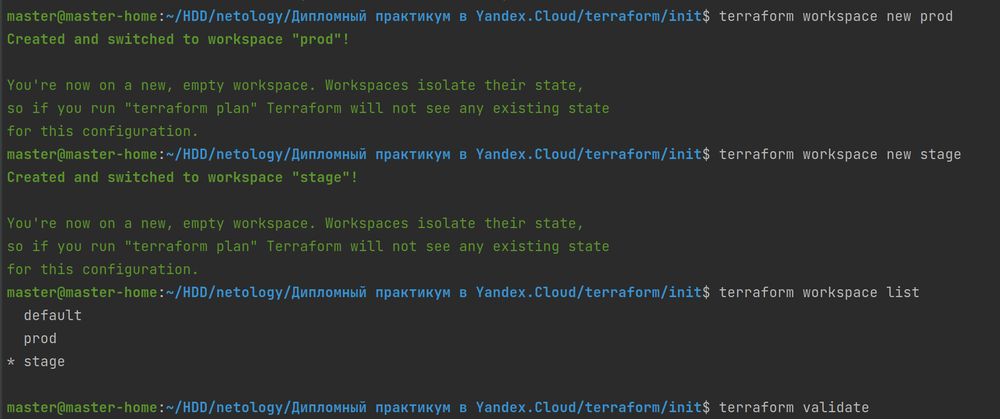
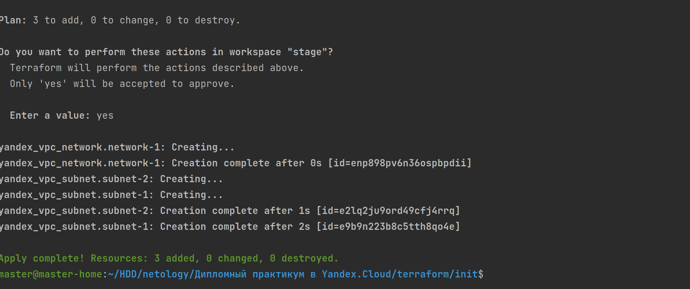
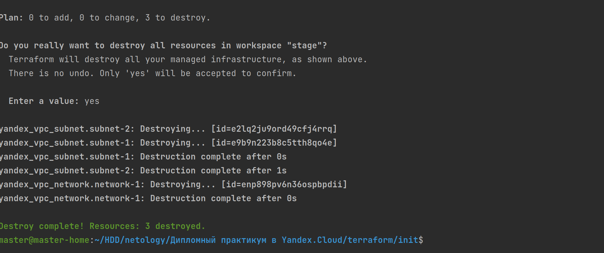
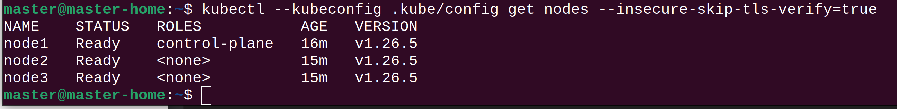
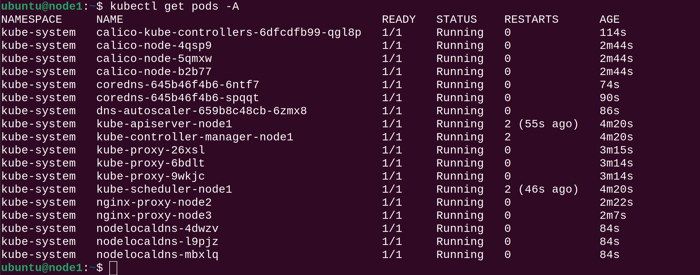
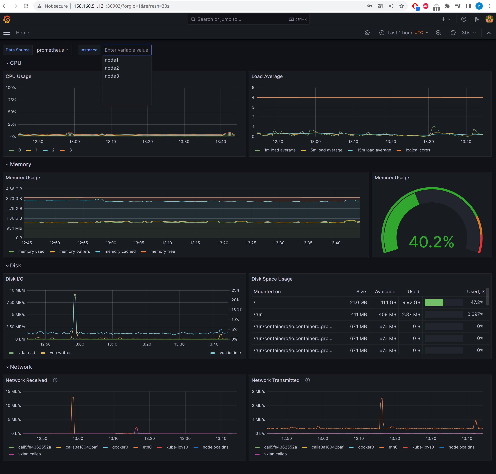
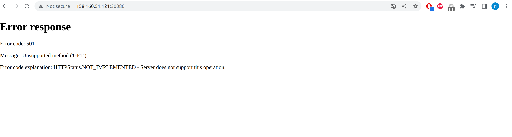
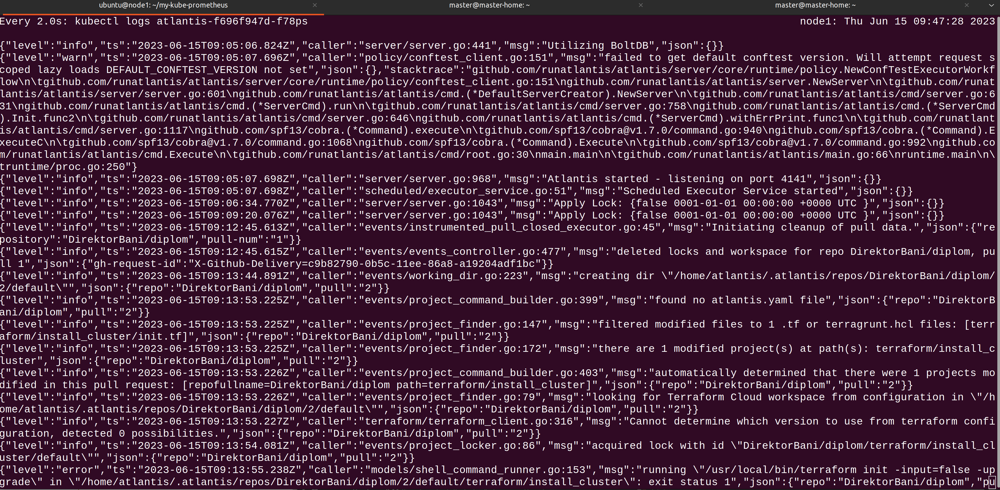

# Дипломный практикум в Yandex.Cloud
* [Цели:](#цели)
* [Эютапы выполнения:](#этапы-выполнения)
    * [Создание облачной инфраструктуры](#создание-облачной-инфраструктуры)
    * [Создание Kubernetes кластера](#создание-kubernetes-кластера)
    * [Создание тестового приложения](#создание-тестового-приложения)
    * [Подготовка cистемы мониторинга и деплой приложения](#подготовка-cистемы-мониторинга-и-деплой-приложения)
    * [Установка и настройка CI/CD](#установка-и-настройка-cicd)
* [Что необходимо для сдачи задания?](#что-необходимо-для-сдачи-задания)
* [Как правильно задавать вопросы дипломному руководителю?](#как-правильно-задавать-вопросы-дипломному-руководителю)

---
## Цели:

1. Подготовить облачную инфраструктуру на базе облачного провайдера Яндекс.Облако.
2. Запустить и сконфигурировать Kubernetes кластер.
3. Установить и настроить систему мониторинга.
4. Настроить и автоматизировать сборку тестового приложения с использованием Docker-контейнеров.
5. Настроить CI для автоматической сборки и тестирования.
6. Настроить CD для автоматического развёртывания приложения.

## Выполнение
Доступы:
``````
Атлантис - http://158.160.51.121:31132/
App - http://158.160.51.121:30080/
Grafana - http://158.160.51.121:30902/ (admin/admin)
GitLab - https://netology-dilom-trachuk.gitlab.yandexcloud.net/netology/test-app/
``````

1. Подготовить облачную инфраструктуру на базе облачного провайдера Яндекс.Облако.

За подготовку инфраструктуры в нашем случае будет отвечать terraform. Был создан файл [init.tf](terraform%2Finstall_cluster%2Finit.tf). Дополнительно к нему создал файл с переменными [variables.tf](terraform%2Finstall_cluster%2Fvariables.tf).
Был испозован s3 YC и созданы воркспейсы.


Была проверена работоспособность apply/destroy





2. Запустить и сконфигурировать Kubernetes кластер.

В качестре установщика кластера был выбран kubespray. Конфигурационные файлы находятся тут [kubespray](terraform%2Finstall_cluster%2Fkubespray) а файл инвентори [inventory.ini](terraform%2Finstall_cluster%2Fkubespray%2Finventory%2Fsample%2Finventory.ini).
Установка прошла без ошибок. Для работы с кластером с домашнего компьютера необходимо скопировать конфиг файл и поменять в нем ip на внешний ip master node.





3. Установить и настроить систему мониторинга.

Для установки системы мониторинга следуем инструкции. Сам example.jsonnet находится тут [example.jsonnet](terraform%2Finstall_cluster%2Fyamls_jsonet%2Fexample.jsonnet)

````sudo apt-get update  
sudo apt-get -y upgrade
sudo wget https://go.dev/dl/go1.17.13.linux-amd64.tar.gz
sudo tar -C /usr/local -xzf go1.17.13.linux-amd64.tar.gz
sudo apt-get install build-essential
mkdir my-kube-prometheus; cd my-kube-prometheus
go install -a github.com/jsonnet-bundler/jsonnet-bundler/cmd/jb@latest
jb init
jb install github.com/prometheus-operator/kube-prometheus/jsonnet/kube-prometheus@main
nano example.jsonnet
./build.sh example.jsonnet
kubectl apply --server-side -f manifests/setup
kubectl apply -f manifests/
kubectl -n monitoring delete networkpolicies.networking.k8s.io --all
````


4. Настроить и автоматизировать сборку тестового приложения с использованием Docker-контейнеров.

Репозиторий с тестовым приложением размещен в гитлаб инстансе https://netology-dilom-trachuk.gitlab.yandexcloud.net/netology/test-app

Dockerfile - https://netology-dilom-trachuk.gitlab.yandexcloud.net/netology/test-app/-/blob/main/Dockerfile

Докерхаб репозиторий - https://hub.docker.com/r/direktorbani/neto/tags

Это простой веб сервер который не умеет обрабатывать GET и выдает 501 ошибку

5. Настроить CI для автоматической сборки

CI файл можно посмотреть в репозитории https://netology-dilom-trachuk.gitlab.yandexcloud.net/netology/test-app/-/blob/main/.gitlab-ci.yml

Реализована ТОЛЬКО сборка и пуш контейнера в докерхаб при обычном коммите и сборка, пуш и деплой при создании тега. 

Создан yaml для деплоя приложения в kubernetes https://netology-dilom-trachuk.gitlab.yandexcloud.net/netology/test-app/-/blob/main/deploy.yaml




6. Atlantis

Отдельно был задеплоен Atlantis. Манифест тут [atlantis.yaml](terraform%2Finstall_cluster%2Fyamls_jsonet%2Fatlantis.yaml)

Пример работы:

https://github.com/DirektorBani/diplom/pull/5




---
## Что необходимо для сдачи задания?

1. Репозиторий с конфигурационными файлами Terraform и готовность продемонстрировать создание всех ресурсов с нуля.

https://github.com/DirektorBani/diplom/tree/dev/terraform/install_cluster

2. Пример pull request с комментариями созданными atlantis'ом или снимки экрана из Terraform Cloud.

https://github.com/DirektorBani/diplom/pull/5


3. Репозиторий с конфигурацией ansible, если был выбран способ создания Kubernetes кластера при помощи ansible.

https://github.com/DirektorBani/diplom/tree/dev/terraform/install_cluster/kubespray/inventory/sample

4. Репозиторий с Dockerfile тестового приложения и ссылка на собранный docker image.

https://hub.docker.com/r/direktorbani/neto/tags

5. Репозиторий с конфигурацией Kubernetes кластера.

https://github.com/DirektorBani/diplom/tree/dev/terraform/install_cluster/yamls_jsonet

6. Ссылка на тестовое приложение и веб интерфейс Grafana с данными доступа.

Атлантис - http://158.160.51.121:31132/
App - http://158.160.51.121:30080/
Grafana - http://158.160.51.121:30902/ (admin/admin)

7. Все репозитории рекомендуется хранить на одном ресурсе (github, gitlab)
